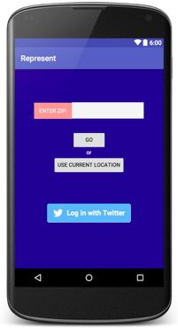
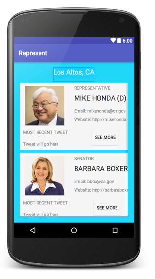
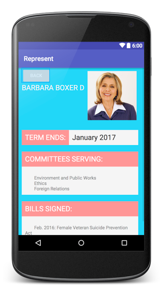
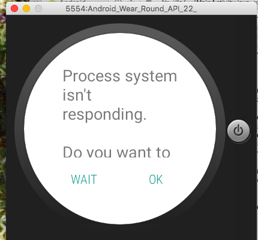

# PROG 02: Represent!

Users can enter a zip code or use their current location to find the Congress representatives for that location. 

## Authors

Claire Lee ([lee.claire@berkeley.edu](mailto:lee.claire@berkeley.edu))

## Demo Video

See [2B YouTube] (https://www.youtube.com/watch?v=JFIOdWcdMwM)
See [2C YouTube] (https://www.youtube.com/watch?v=JFIOdWcdMwM)

## Reference for the grader (2B)
* Does the video demonstrate all of the screens (Mobile: Main, Congressional, Detailed; Watch: Main, 2012 Vote)? (5 pts) YES
* Does the Main View (mobile) allow users to input a zip code/current location, and open both a Congressional View on the phone and a Main View on the watch with the appropriate information? (5 pts) YES
* Do the Congressional View, Detailed View (mobile), and Watch View (wear) render all the correct information (see PROG 02-A for full list)? (10 pts) YES
* Can you swipe through a list of congressional representatives on the watch? (5 pts) YES
* Does selecting a member of congress on the watch change the Detailed View on the phone? (5 pts) NO
* Does the changing the location result in a change in the results of the 2012 Vote View? (5 pts) SORTA
* Does changing the accelerometer value of the watch (to simulate a shake) randomly select a location in the US, updating information accordingly? (5 points) YES

## Reference for the grader (2C)
* Does your app get the current location correctly on the phone? (2 points) YES!
* Does your app correctly lookup Senator and House Representative data by location? Do you disambiguate cases by zip code where there are multiple representatives? (5 points) YES!!
* Does your app use the APIs to get and display the required data for each congressperson: full name, their party (Democrat, Republican, Independent), email (with link), website (with link), on both the phone and watch? (10 points) ON PHONE YES, WATCH IF YOU LOOK AT THE CODE IT SHOULD POPULATE CORRECTLY, BUT UNFORTUNATELY NOTHING SHOWS UP ON WATCH INTERFACE DUE TO UNKNOWN BUG
* Does your app correctly display the last Tweet and a photo for each congressperson on the phone? (5 points) PHOTO YES BUT NO TWEET
* Does your app correctly lookup the State and County (from the current location/zip code) and display the correct election results for the 2012 Obama/Romney percentages on the watch? (10 points) GRABS THE COUNTY (This took a long time would definitely appreciate some points..Stopped doing county because impossible to check without my watch interfae working))
** 4 of these points are from updating the information via a random location on a watch shake. LOOK AT CODE FOR SHAKE :-)) IS WELL IMPLEMENTED

* Design: Does your app make good use of visual elements and an intuitive, easy-to-use interaction flow? (15 points) 
A part of this grade is on iteration: If you made any design changes from Prog2A, please describe them (with before/after screenshots + text) in your PDF.
* Documentation: narrated video, github updated with new APKs, PDF contains screenshots + descriptions of the app (3 pts) YES
* Extra Credit: Up to 10 points of extra credit will be offered for this assignment, mostly through strong design and additional, helpful features. Suggestions to get you started:
Display representative photos on the watch
Display embedded maps, color coded to voting data
Incorporating current 2016 election data

## Screenshots

## Acknowledgments

* CS 160 Staff
* Google
